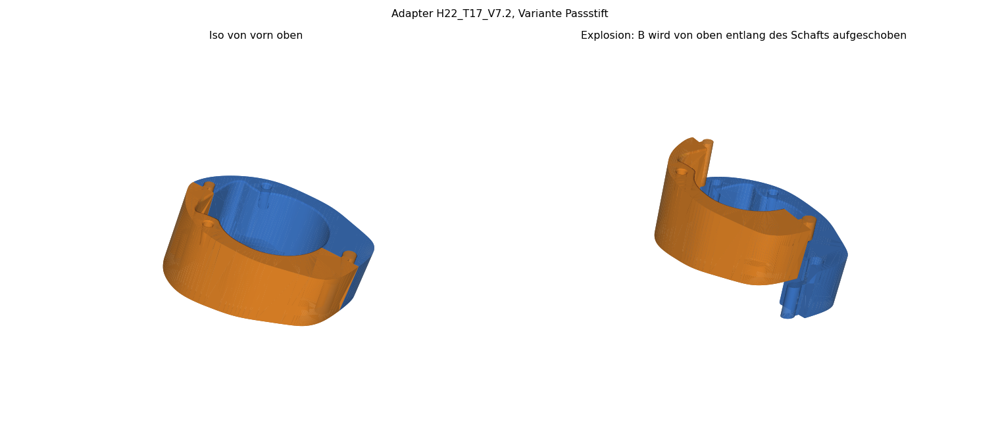
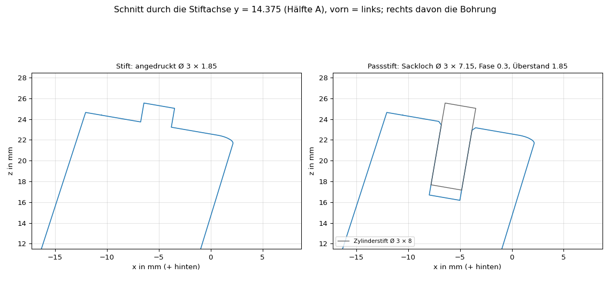

# Trek Émonda × Tavelo Avro Rise – Spacer-Adapter


Zweiteiliger, 3D-gedruckter Adapter, mit dem ein integriertes **Tavelo Avro Rise**-Cockpit auf einem **Trek Émonda SL 6 (2024)** sitzt. Der originale Trek-Steuersatzdeckel bleibt unverändert, die Bremsleitungen laufen innen, und die Hydraulik muss nicht geöffnet werden.

Das Modell ist parametrisch (Python/CadQuery). Wer einen anderen Rahmen oder andere Winkel hat, ändert ein paar Zahlen und exportiert neu.

**Stand (Rev. D, 2026-10-02):** Geometrie abgeschlossen für die Bezugshöhe 22 mm. Drei Prototypen wurden gedruckt und am Rad geprüft; der dritte (Variante Passstift, PETG-HF) passt ohne weitere Korrektur. Für den Dauerbetrieb empfohlen bleibt PA12 (MJF), siehe [Drucken](#drucken). Befunde, Entscheidungen und offene Punkte: [`KONSTRUKTION.md`](KONSTRUKTION.md).

## Für welches Rad und welches Cockpit

Konstruiert und vermessen an genau dieser Kombination:

| | |
|---|---|
| Rahmen | **Trek Émonda SL 6, Modelljahr 2024** (Gen-3-Plattform), 500 Series OCLV Carbon (**SL, nicht SLR**), Größe 54 |
| Artikel | GTIN/EAN 768682472743, Trek-Teilenr. 5297498 |
| Steuersatz | originaler Trek-Steuersatzdeckel mit zwei Nasen hinten, bleibt montiert |
| Gabelschaft | Carbon, Ø 28,6, seitlich abgeflacht auf 26,75 |
| Schaltung | **105 Di2** (funkend): durch den Adapter laufen nur zwei Bremsleitungen, keine Schaltzüge |
| Cockpit | **Tavelo Avro Rise**, 380 mm Breite, 80 mm Länge, −10° |

Nicht geprüft, aber naheliegend:
- **Andere Größen des Émonda SL:** Der Deckel ist vermutlich gleich, der Trek-Winkel kann aber vom Lenkwinkel der Größe abhängen (siehe [An ein anderes Rad anpassen](#an-ein-anderes-rad-anpassen)).
- **Andere Breiten und Längen des Avro Rise:** Die Sitzfläche des Vorbaus sollte gleich sein, das ist aber nicht nachgemessen.
- **Émonda SLR, ältere Modelljahre, andere Tavelo-Modelle, mechanische Schaltungen:** nicht kompatibel bzw. ungeprüft. Maße und Winkel stehen in [`KONSTRUKTION.md`](KONSTRUKTION.md), das Modell lässt sich anpassen.

## Variante wählen

Es gibt zwei Varianten. Sie sind bis auf die beiden Stifte oben, die in die Sacklöcher des Vorbaus greifen, identisch.

| | **Passstift** (empfohlen) | **Stift** |
|---|---|---|
| Stifte oben | Zylinderstifte aus Edelstahl, eingeklebt | angedruckt, Ø 3 × 1,85 |
| Am Rad geprüft | Prototyp 3 | Prototyp 1 und 2 (Stifte passten) |
| Druckdatei | [`02_CAD/out/Passstift/`](02_CAD/out/Passstift) | [`02_CAD/out/Stift/`](02_CAD/out/Stift) |
| Zusätzlich nötig | 2 × Zylinderstift ISO 2338 Ø 3 m6 × 8, Edelstahl A2/A4; Klebstoff (2K-Epoxid oder Cyanacrylat) | nichts |
| Eigenschaften | Stahlstift belastbarer als ein gedruckter; Stift sitzt auf dem Lochgrund, die Lochtiefe (6,15) legt den Überstand 1,85 fest | keine Zukaufteile; bei FDM liegt am Fuß des Stifts eine Schichtgrenze |

| Passstift | Stift |
|---|---|
|  |  |



## Auf einen Blick

| | |
|---|---|
| Unterseite | passt auf den Trek-Deckel: Neigung α_T = 17°, zwei Nasen greifen in Taschen |
| Oberseite | passt unter den Tavelo-Vorbau: Neigung α_V ≈ 7,2° (gemessen 8°, am Prototyp 2 korrigiert), zwei Stifte Ø 3 × 1,85 greifen in die Sacklöcher |
| Keil | ≈ 9,8°, hinten dünn, vorn dick (auf einer ebenen Fläche: Hinterkante 16,3 mm, Spitze 26,2 mm hoch) |
| Höhe | 22 mm entlang der Schaftachse als Bezug (rechnerisch 22,4 mm am Durchstoßpunkt der Achse, siehe `KONSTRUKTION.md`, D-6) |
| Schaft | Ø 28,6 (seitlich abgeflacht auf 26,75), Bohrung Ø 30 als Langloch 2 mm nach hinten (32 × 30): Die Lage kommt von Nasen und Stiften, nicht vom Schaft |
| Leitungen | Kanal vor dem Schaft für zwei Bremsleitungen; unten seitlich angeschrägt, weil die hintere Leitung seitlich aus dem Trek-Deckel kommt |
| Teilung | zwei Hälften mit Gelenk nach Tavelo-Vorbild, werden entlang des Schafts zusammengeschoben |
| Kanten | innere Kanten an Ober- und Unterseite R 0,5, Übergang Bohrung → Leitungskanal R 2 |
| Werkstoff | empfohlen PA12, MJF-Druck; Prototyp 3 aus PETG-HF |

## Drucken

Am einfachsten lädt man unter [Releases](https://github.com/ThomasBirkmaier/trek-emonda-tavelo-spacer-adapter/releases) das ZIP der gewünschten Variante. Die Druckdatei `DRUCK_Adapter_H22_T17_V7.2_<Variante>` (`.stl`, `.3mf` oder `.step`) enthält beide Hälften, getrennt gelegt, Unterseite auf dem Druckbett. Bei einem Druckdienst (zum Beispiel Craftcloud) ist die Menge daher 1.

- **Verfahren und Werkstoff:** Für den Fahrbetrieb wird PA12 (MJF) empfohlen: Das Teil liegt in der Kraftkette der Lagervorspannung und wird warm. PETG (auch PETG-HF) kann unter dieser Last kriechen; wer es fährt, sollte das Steuersatzspiel anfangs häufig prüfen. Kein PLA. Für eine Passprobe reicht FDM.
- **Passungen:** Bohrung Ø 30 (0,7 mm Spiel radial zum Schaft, 2 mm Langloch nach hinten), Gelenk 0,2 mm Spiel radial, Nasentaschen 0,55 mm pro Seite quer und 0,3 mm längs, 3 mm tief. Sackloch der Variante Passstift Ø 3,0 × 6,15 mit Fase 0,3 (`PINHOLE_D` lässt sich an das Druckverfahren anpassen).
- **Dateinamen:** Bezugshöhe, Winkel und Variante stehen im Namen (`_H22_T17_V7.2_Passstift`). `Adapter_*` ist der zusammengebaute Zustand zur Ansicht, `DRUCK_*` die Druckdatei.

## Modell anpassen

Voraussetzung: Python 3.10–3.12 (getestet mit 3.11, Versionen in [`requirements.txt`](requirements.txt)).

```bash
git clone https://github.com/ThomasBirkmaier/trek-emonda-tavelo-spacer-adapter.git
cd trek-emonda-tavelo-spacer-adapter
python -m venv .venv && source .venv/bin/activate
pip install -r requirements.txt

python 02_CAD/adapter.py             # exportiert beide Varianten nach 02_CAD/out/Stift und 02_CAD/out/Passstift
python 02_CAD/check_adapter.py       # Kollision der Hälften, Bohrungsmaß, Wandstärken
python 02_CAD/render_adapter.py      # Schnitte, Iso-Ansichten, Drucklayout
```

Die Parameter stehen oben in [`02_CAD/adapter.py`](02_CAD/adapter.py):

| Parameter | Bedeutung | Aktuell |
|---|---|---|
| `ALPHA_TREK` | Neigung der Trek-Sitzfläche gegen die Schaftnormale | 17,0° (an den Prototypen bestätigt) |
| `ALPHA_TAVELO_MEAS`, `HEIGHT_REF` | gemessene Neigung der Tavelo-Sitzfläche, Bezugshöhe entlang der Schaftachse | 8,0°, 22 mm |
| `TOP_FRONT_LIFT` | Korrektur der Oberseite: um ihre Hinterkante gekippt, Spitze so viel höher; daraus ergeben sich `ALPHA_TAVELO` und `HEIGHT`. Der Vorbau sitzt dadurch nicht höher, nur der Spalt vorn wird gefüllt | 0,8 mm → 7,21°, 22,42 mm |
| `JOINT_CLEAR` | radiales Spiel im Gelenk | 0,2 mm |
| `BORE_D`, `BORE_SLOT` | Bohrungsdurchmesser, Langloch nach hinten | 30 mm (Schaft 28,6), 2 mm |
| `POCKET_CLEAR_W`, `POCKET_CLEAR`, `POCKET_DEPTH` | Nasentaschen: Spiel quer und längs pro Seite, Tiefe | 0,55 mm, 0,3 mm, 3 mm |
| `outline_wire_pts()`, `NOSE_*`, `PIN_*` | Kontur, Nasen, Stifte | laut Skizze V2 und Prototypen |
| `VARIANTS`, `DOWEL_L`, `PINHOLE_*` | Varianten; Länge des Zylinderstifts, Sackloch (Ø, Tiefe, Fase) | Ø 3 × 8; Loch Ø 3,0 × 6,15, Fase 0,3 |

### An ein anderes Rad anpassen

Die Stapelhöhe stellt man über `HEIGHT_REF` ein. Zwischen Schaftende und Oberkante Vorbau muss ein Spalt bleiben (üblich 2–3 mm), damit die Top-Cap Vorspannung aufbauen kann.

Die Winkel prüft man an einem Probedruck über die beiden Fugen:
- **Untere Fuge** (Trek-Deckel ↔ Adapter) klafft hinten: `ALPHA_TREK` zu groß; klafft sie vorn: zu klein. Über die Länge ergibt 1° etwa 1 mm Spalt.
- **Obere Fuge** (Adapter ↔ Vorbau) klafft vorn: den gemessenen Spalt zu `TOP_FRONT_LIFT` addieren; klafft sie hinten: abziehen.

## Repository-Struktur

| Pfad | Inhalt |
|---|---|
| [`KONSTRUKTION.md`](KONSTRUKTION.md) | Schnittstellen, Koordinatensystem, Maße, Winkel, Konstruktionsentscheidungen, Befund der Prototypen, offene Punkte, Revisionen |
| [`CLAUDE.md`](CLAUDE.md) | Einstieg für KI-Assistenten (Claude Code): Befehle und Fallstricke der Geometrie |
| `01_Input/` | Skizze, Herstellerzeichnung und Fotos, die ins Modell eingeflossen sind (Rohdaten; die Skizze nennt noch die Länge 52,2, richtig ist 58) |
| `02_CAD/adapter.py` | parametrisches Modell, einzige Quelle der Geometrie |
| `02_CAD/check_adapter.py`, `02_CAD/render_adapter.py` | Prüfungen und Renderings |
| `02_CAD/out/Passstift/`, `02_CAD/out/Stift/` | Exporte je Variante: `DRUCK_*` druckfertig, `Adapter_*` zusammengebaut |
| `.github/workflows/release.yml` | legt bei einem Tag `rev-<Revision>` einen Release mit je einem ZIP pro Variante an |
| `03_Renderings/` | Aufmacherbild (generiert, ohne Maßbezug), sonst von `render_adapter.py` erzeugt: Schnitte, Iso-Ansicht je Variante, Schnitt durch die Stifte, Drucklayout |


## Hinweis zur Sicherheit

Der Adapter sitzt am Steuersatz und damit an einem sicherheitsrelevanten Bauteil. Er ist ein privates Eigenbauprojekt ohne Herstellerfreigabe, ohne Festigkeitsnachweis und ohne Langzeiterprobung. Maße und Winkel vor dem Druck am eigenen Rad prüfen; Steuersatz und Cockpit fachgerecht nach Herstellerangaben montieren. Nutzung auf eigene Verantwortung.

## Lizenz

[WTFPL](LICENSE): Jeder darf damit machen, was er will. Ohne jede Gewährleistung, siehe Hinweis zur Sicherheit.

Ausgenommen ist die Geometriezeichnung des Herstellers in `01_Input/Tavelo_Avro_Rise_Geometrie.png`; die Rechte daran liegen bei Tavelo. Marken- und Produktnamen gehören ihren Inhabern; das Projekt steht in keiner Verbindung zu Trek oder Tavelo.
