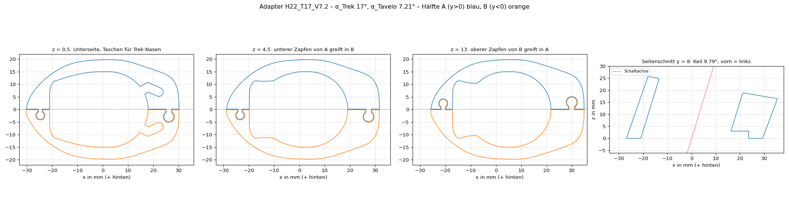

# Trek Émonda × Tavelo Avro Rise – Spacer-Adapter


Zweiteiliger, 3D-gedruckter Adapter, mit dem ein integriertes **Tavelo Avro Rise**-Cockpit auf einem **Trek Émonda SL 6 (2024)** sitzt. Der originale Trek-Steuersatzdeckel bleibt unverändert, die Bremsleitungen laufen innen, und für die Montage muss die Hydraulik nicht geöffnet werden.

Das Modell ist parametrisch (Python/CadQuery). Wer einen anderen Rahmen oder andere Winkel hat, ändert ein paar Zahlen und exportiert neu.

**Stand (Rev. C.4, 2026-10-01):** Zwei Prototypen wurden gedruckt und am Rad geprüft, alle Korrekturen sind eingearbeitet. Als Nächstes kommt Prototyp 3, das Endteil in PA12 ist noch nicht gedruckt. Details, Befund und offene Punkte: [`KONSTRUKTION.md`](KONSTRUKTION.md).

## Für welches Rad und welches Cockpit

Konstruiert und vermessen an genau dieser Kombination:

| | |
|---|---|
| Rahmen | **Trek Émonda SL 6, Modelljahr 2024** (Gen-3-Plattform), 500 Series OCLV Carbon (**SL, nicht SLR**), Größe 54 |
| Artikel | GTIN/EAN 768682472743, Trek-Teilenr. 5297498 |
| Steuersatz | originaler Trek-Steuersatzdeckel mit zwei Nasen hinten, bleibt montiert |
| Gabelschaft | Carbon, Ø 28,6, seitlich abgeflacht auf 26,75 |
| Schaltung | **105 Di2** (funkend): durch den Adapter laufen nur zwei Bremsleitungen, keine Schaltzüge |
| Cockpit | **Tavelo Avro Rise**, 380 mm Breite, 80 mm Länge, −10° |

Nicht geprüft, aber naheliegend:
- **Andere Größen des Émonda SL:** Der Deckel ist vermutlich gleich, der Trek-Winkel kann aber vom Lenkwinkel der Größe abhängen. Deshalb nach der Montage die untere Fuge prüfen (siehe Montage).
- **Andere Breiten und Längen des Avro Rise:** Die Sitzfläche des Vorbaus sollte gleich sein, das ist aber nicht nachgemessen.
- **Émonda SLR, ältere Modelljahre, andere Tavelo-Modelle, mechanische Schaltungen:** nicht kompatibel bzw. ungeprüft. Maße und Winkel stehen in [`KONSTRUKTION.md`](KONSTRUKTION.md), das Modell lässt sich anpassen.

## Auf einen Blick

| | |
|---|---|
| Unterseite | passt auf den Trek-Deckel: Neigung α_T = 17°, zwei Nasen rasten ein |
| Oberseite | passt unter den Tavelo-Vorbau: Neigung α_V ≈ 7,2° (gemessen 8°, am Prototyp 2 korrigiert), zwei Stifte Ø 3 greifen in die Sacklöcher |
| Keil | ≈ 9,8°, hinten dünn, vorn dick (auf einer ebenen Fläche: Hinterkante 16,3 mm, Spitze 26,2 mm hoch) |
| Höhe | 22 mm entlang der Schaftachse als Bezug: 2 mm mehr als der ersetzte 20-mm-Spacerstapel, damit die Top-Cap Spalt zum Schaftende hat. Die Keilkorrektur nach Prototyp 2 füllt nur den Spalt vorn, der Vorbau sitzt dadurch nicht höher (rechnerisch 22,4 mm an der Achse, siehe `KONSTRUKTION.md`, D-6) |
| Schaft | Ø 28,6 (seitlich abgeflacht auf 26,75), Bohrung Ø 30 als Langloch 2 mm nach hinten (32 × 30): Die Lage kommt von Nasen und Stiften |
| Leitungen | Kanal vor dem Schaft für zwei Bremsleitungen (Di2, funkend); unten seitlich angeschrägt, weil die hintere Leitung seitlich aus dem Trek-Deckel kommt |
| Teilung | zwei Hälften mit Gelenk nach Tavelo-Vorbild, werden entlang des Schafts zusammengeschoben |
| Kanten | innere Kanten an Ober- und Unterseite R 0,5, Übergang Bohrung → Leitungskanal R 2 |
| Werkstoff | PA12, MJF-Druck |

## Schnellstart

### Ich will nur drucken

1. Datei **`02_CAD/out/DRUCK_Adapter_H22_T17_V7.2.stl`** (oder `.3mf`/`.step`) bei einem Druckdienst hochladen, zum Beispiel Craftcloud. Die Datei enthält beide Hälften, getrennt gelegt; die Menge ist 1.
2. Verfahren **MJF**, Material **PA12**, Farbe schwarz. Zum Fahren kein FDM/PLA/PETG: Das Teil liegt in der Kraftkette der Lagervorspannung. Für eine reine Passprobe reicht ein FDM-Druck (Unterseite aufs Druckbett, so liegt sie in der Datei).

Passungen: Bohrung Ø 30 (0,7 mm Spiel radial zum Schaft, nach hinten 2 mm Langloch), Gelenk 0,2 mm Spiel radial, Nasentaschen 0,55 mm pro Seite quer und 0,3 mm in Längsrichtung, 3 mm tief. Klemmt das Gelenk nach dem Druck, die Zapfen leicht nachschleifen oder `JOINT_CLEAR` erhöhen.

### Ich will das Modell anpassen

Voraussetzung: Python 3.10–3.12 (getestet mit 3.11).

```bash
git clone https://github.com/ThomasBirkmaier/trek-emonda-tavelo-spacer-adapter.git
cd trek-emonda-tavelo-spacer-adapter
python -m venv .venv && source .venv/bin/activate
pip install -r requirements.txt

python 02_CAD/adapter.py             # exportiert den Adapter nach 02_CAD/out
python 02_CAD/check_adapter.py       # Kollision der Hälften, Bohrungsmaß, Wandstärken
python 02_CAD/render_adapter.py      # Schnitte, Iso-Ansicht, Drucklayout
```

Die Parameter stehen oben in [`02_CAD/adapter.py`](02_CAD/adapter.py):

| Parameter | Bedeutung | Aktuell |
|---|---|---|
| `ALPHA_TREK` | Neigung der Trek-Sitzfläche gegen die Schaftnormale | 17,0° (am Prototyp bestätigt) |
| `ALPHA_TAVELO_MEAS`, `HEIGHT_REF` | gemessene Neigung der Tavelo-Sitzfläche, Bezugshöhe entlang der Schaftachse | 8,0°, 22 mm |
| `TOP_FRONT_LIFT` | Korrektur aus Prototyp 2: Oberseite um ihre Hinterkante gekippt, Spitze so viel höher; daraus ergeben sich `ALPHA_TAVELO` und `HEIGHT`. Der Vorbau sitzt dadurch nicht höher, nur der Spalt vorn wird gefüllt | 0,8 mm → 7,21°, 22,42 mm |
| `JOINT_CLEAR` | radiales Spiel im Gelenk | 0,2 mm (bei engen Toleranzen 0,3) |
| `BORE_D`, `BORE_SLOT` | Bohrungsdurchmesser, Langloch nach hinten | 30 mm (Schaft 28,6), 2 mm |
| `POCKET_CLEAR_W`, `POCKET_CLEAR`, `POCKET_DEPTH` | Nasentaschen: Spiel quer und längs pro Seite, Tiefe | 0,55 mm, 0,3 mm, 3 mm |
| `outline_wire_pts()`, `NOSE_*`, `PIN_*` | Kontur, Nasen, Stifte | laut Skizze V2 |

Bezugshöhe und Winkel stehen im Dateinamen der Exporte (`..._H22_T17_V7.2`), damit man sieht, welche Version man druckt.

## Montage

1. Vorbau abnehmen; der Trek-Deckel bleibt, die Leitungen bleiben angeschlossen.
2. Hälfte **A** (Zapfen unten) seitlich an Schaft und Leitungen legen, die Nase sitzt in der Tasche.
3. Hälfte **B** (Zapfen oben) seitlich ansetzen und **entlang des Schafts** von oben einschieben, bis sie aufsitzt.
4. Tavelo-Vorbau aufsetzen, die Stifte rasten in die Sacklöcher, Vorspannung wie gewohnt einstellen. Zwischen Schaftende und Oberkante Vorbau muss ein Spalt bleiben (üblich 2–3 mm), sonst sitzt die Top-Cap auf dem Schaft auf und baut keine Vorspannung auf. Prüfung: Der Trek-Deckel darf sich danach nicht mehr verdrehen lassen.
5. Beide Fugen gegen Licht prüfen: Trek-Deckel ↔ Adapter und Adapter ↔ Vorbau.
   Klafft die untere Fuge, stimmt `ALPHA_TREK` nicht: Spalt **hinten** → Wert zu groß, Spalt **vorn** → Wert zu klein. Anpassen (1° ≈ 1 mm Spalt über die Länge) und neu exportieren.
   Klafft die obere Fuge vorn, den gemessenen Spalt zu `TOP_FRONT_LIFT` addieren (klafft sie hinten: abziehen) und neu exportieren.
6. Nach den ersten Ausfahrten das Steuersatzspiel prüfen und bei Bedarf nachstellen: Kunststoff kann sich unter der Vorspannung etwas setzen.

## Repository-Struktur

| Pfad | Inhalt |
|---|---|
| [`KONSTRUKTION.md`](KONSTRUKTION.md) | Schnittstellen, Koordinatensystem, Maße, Winkel, Konstruktionsentscheidungen, Befund Prototyp, offene Punkte |
| [`CLAUDE.md`](CLAUDE.md) | Arbeitsanweisungen für Claude Code (Einstieg in neue Sessions) |
| `01_Input/` | Skizze, Herstellerzeichnung und Fotos, die ins Modell eingeflossen sind (Rohdaten; die Skizze enthält noch die verworfene Länge 52, richtig ist 58) |
| `02_CAD/adapter.py` | parametrisches Modell, einzige Quelle der Geometrie |
| `02_CAD/check_adapter.py`, `02_CAD/render_adapter.py` | Prüfungen und Renderings |
| `02_CAD/out/` | `Adapter_*` = zusammengebaut (Ansicht); `DRUCK_*` = druckfertig |
| `03_Renderings/` | Aufmacherbild (generiert, Rev. C), Schnitte, Iso-Ansicht, Drucklayout (von `render_adapter.py` erzeugt) |



## Hinweis zur Sicherheit

Der Adapter sitzt am Steuersatz und damit an einem sicherheitsrelevanten Bauteil. Er ist ein privates Eigenbauprojekt, nicht vom Hersteller freigegeben und nicht im Fahrbetrieb erprobt. Maße und Winkel vor dem Druck am eigenen Rad prüfen. Nutzung auf eigene Verantwortung.

## Lizenz

[WTFPL](LICENSE): Jeder darf damit machen, was er will. Ohne jede Gewährleistung, siehe Hinweis zur Sicherheit.
