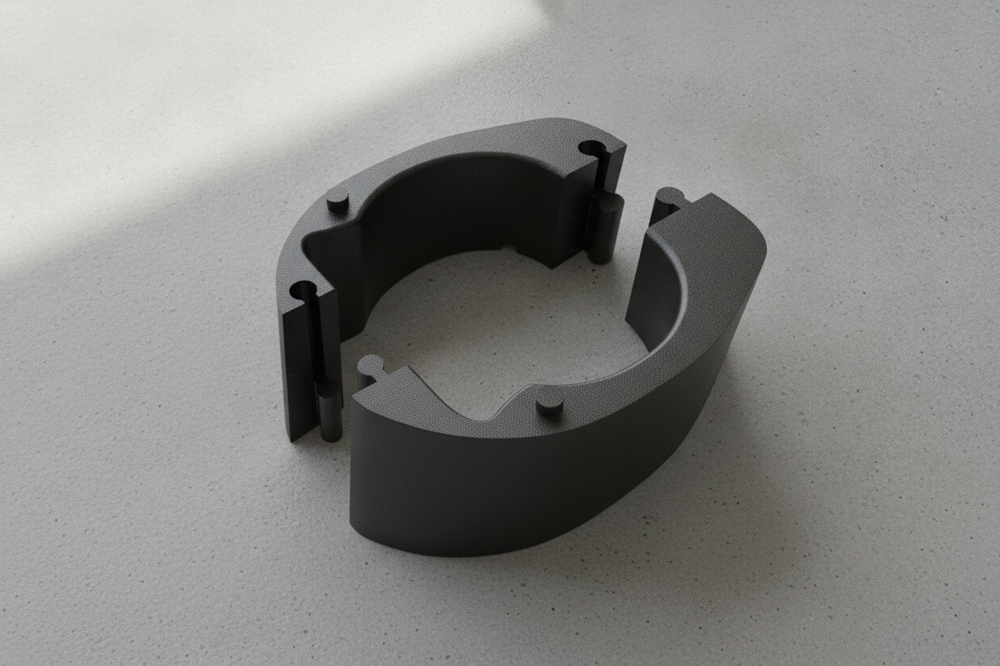
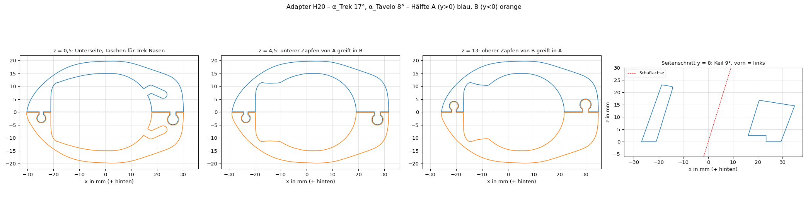

# Trek Émonda × Tavelo Avro Rise – Spacer-Adapter



Zweiteiliger, 3D-gedruckter Adapter, mit dem ein integriertes **Tavelo Avro Rise**-Cockpit auf einem **Trek Émonda SL 6 (2024)** sitzt. Der originale Trek-Steuersatzdeckel bleibt unverändert, die Bremsleitungen laufen innen, und für die Montage muss die Hydraulik nicht geöffnet werden.

Das Modell ist parametrisch (Python/CadQuery). Wer einen anderen Rahmen oder andere Winkel hat, ändert ein paar Zahlen und exportiert neu.

## Für welches Rad und welches Cockpit

Konstruiert und vermessen an genau dieser Kombination:

| | |
|---|---|
| Rahmen | **Trek Émonda SL 6, Modelljahr 2024** (Gen-3-Plattform), 500 Series OCLV Carbon (**SL, nicht SLR**), Größe 54 |
| Artikel | GTIN/EAN 768682472743, Trek-Teilenr. 5297498 |
| Steuersatz | originaler Trek-Steuersatzdeckel mit zwei Nasen hinten, bleibt montiert |
| Gabelschaft | Carbon, Ø 28,6, seitlich abgeflacht auf 26,75 |
| Schaltung | **105 Di2** (funkend): durch den Adapter laufen nur zwei Bremsleitungen, keine Schaltzüge |
| Cockpit | **Tavelo Avro Rise**, 380 mm Breite, 80 mm Länge, −10° |

Nicht geprüft, aber naheliegend:
- **Andere Größen des Émonda SL:** Der Deckel ist vermutlich gleich, der Trek-Winkel kann aber vom Lenkwinkel der Größe abhängen. Deshalb vorher mit den Lehrkeilen prüfen.
- **Andere Breiten und Längen des Avro Rise:** Die Sitzfläche des Vorbaus sollte gleich sein, das ist aber nicht nachgemessen.
- **Émonda SLR, ältere Modelljahre, andere Tavelo-Modelle, mechanische Schaltungen:** nicht kompatibel bzw. ungeprüft. Maße und Winkel stehen in [`KONSTRUKTION.md`](KONSTRUKTION.md), das Modell lässt sich anpassen.

## Auf einen Blick

| | |
|---|---|
| Unterseite | passt auf den Trek-Deckel: Neigung α_T ≈ 17°, zwei Nasen rasten ein |
| Oberseite | passt unter den Tavelo-Vorbau: Neigung α_V = 8°, zwei Stifte Ø 3 greifen in die Sacklöcher |
| Keil | ≈ 9°, hinten dünn (15,5 mm), vorn dick (24,3 mm) |
| Höhe | 20 mm entlang der Schaftachse (ersetzt einen 20-mm-Spacerstapel) |
| Schaft | Ø 28,6 (seitlich abgeflacht auf 26,75), Bohrung Ø 28,9 |
| Leitungen | Kanal vor dem Schaft für zwei Bremsleitungen (Di2, funkend) |
| Teilung | zwei Hälften mit Gelenk nach Tavelo-Vorbild, werden entlang des Schafts zusammengeschoben |
| Werkstoff | PA12, MJF-Druck |

## Schnellstart

### Ich will nur drucken

1. Datei **`02_CAD/out/DRUCK_Adapter_H20_T17_V8.stl`** (oder `.3mf`/`.step`) bei einem Druckdienst hochladen, zum Beispiel Craftcloud. Die Datei enthält beide Hälften, getrennt gelegt; die Menge ist 1.
2. Verfahren **MJF**, Material **PA12**, Farbe schwarz. Kein FDM/PLA/PETG: Das Teil liegt in der Kraftkette der Lagervorspannung.
3. Empfohlen: vorher mit den **Lehrkeilen** den Trek-Winkel am eigenen Rad prüfen (siehe unten).

Passungen: Bohrung 0,15 mm und Gelenk 0,2 mm Spiel radial, Nasentaschen 0,3 mm pro Seite. Klemmt das Gelenk nach dem Druck, die Zapfen leicht nachschleifen oder `JOINT_CLEAR` erhöhen.

### Trek-Winkel prüfen (Lehrkeile)

`02_CAD/out/DRUCK_Lehrkeil_15…19deg`: fünf 4 mm dünne Keile mit 15–19°, je zweiteilig ohne Gelenk. SLA-Resin reicht, das kostet wenige Euro.

1. Vorbau abnehmen, der Trek-Deckel bleibt drauf.
2. Beide Hälften um Schaft und Leitungen legen, die Nasen in die Taschen setzen und die Hälften zusammenhalten.
3. Gegen Licht prüfen: Der Keil, der ohne Spalt und ohne Kippeln aufliegt, gibt α_T an.
   - Spalt **hinten** (bei den Nasen): Winkel zu groß → nächstkleineren Keil probieren
   - Spalt **vorn** (an der Spitze): Winkel zu klein → nächstgrößeren Keil probieren
4. Weicht der Wert von 17° ab: `ALPHA_TREK` anpassen und neu exportieren.

### Ich will das Modell anpassen

Voraussetzung: Python 3.10–3.12.

```bash
git clone https://github.com/ThomasBirkmaier/trek-emonda-tavelo-spacer-adapter.git
cd trek-emonda-tavelo-spacer-adapter
python -m venv .venv && source .venv/bin/activate
pip install -r requirements.txt

python 02_CAD/adapter.py             # exportiert Adapter + Lehrkeile nach 02_CAD/out
python 02_CAD/render_adapter.py      # Schnitte, Iso-Ansicht
python 02_CAD/render_lehrkeil.py 17  # Rendering eines Lehrkeils
```

Die Parameter stehen oben in [`02_CAD/adapter.py`](02_CAD/adapter.py):

| Parameter | Bedeutung | Aktuell |
|---|---|---|
| `ALPHA_TREK` | Neigung der Trek-Sitzfläche gegen die Schaftnormale | 17,0° (mit den Lehrkeilen prüfen) |
| `ALPHA_TAVELO` | Neigung der Tavelo-Sitzfläche gegen die Schaftnormale | 8,0° (gemessen) |
| `HEIGHT` | Höhe entlang der Schaftachse | 20 mm |
| `JOINT_CLEAR` | radiales Spiel im Gelenk | 0,2 mm (bei engen Toleranzen 0,3) |
| `BORE_CLEAR` | radiales Spiel Bohrung/Schaft | 0,15 mm |
| `outline_wire_pts()`, `NOSE_*`, `PIN_*` | Kontur, Nasen, Stifte | laut Skizze V2 |

Die Winkel stehen im Dateinamen der Exporte (`..._T17_V8`), damit man sieht, welche Version man druckt.

## Montage

1. Vorbau abnehmen; der Trek-Deckel bleibt, die Leitungen bleiben angeschlossen.
2. Hälfte **A** (Zapfen unten) seitlich an Schaft und Leitungen legen, die Nase sitzt in der Tasche.
3. Hälfte **B** (Zapfen oben) seitlich ansetzen und **entlang des Schafts** von oben einschieben, bis sie aufsitzt.
4. Tavelo-Vorbau aufsetzen, die Stifte rasten in die Sacklöcher, Vorspannung wie gewohnt einstellen.
5. Beide Fugen gegen Licht prüfen: Trek-Deckel ↔ Adapter und Adapter ↔ Vorbau.

## Repository-Struktur

| Pfad | Inhalt |
|---|---|
| [`KONSTRUKTION.md`](KONSTRUKTION.md) | Schnittstellen, Koordinatensystem, Maße, Winkel, Konstruktionsentscheidungen |
| `01_Input/` | Skizze, Herstellerzeichnung und Fotos, die ins Modell eingeflossen sind |
| `02_CAD/adapter.py` | parametrisches Modell, einzige Quelle der Geometrie |
| `02_CAD/out/` | `Adapter_*` = zusammengebaut (Ansicht); `DRUCK_*` = druckfertig |
| `03_Renderings/` | Aufmacherbild, Schnitte, Iso-Ansicht, Drucklayout |



## Hinweis zur Sicherheit

Der Adapter sitzt am Steuersatz und damit an einem sicherheitsrelevanten Bauteil. Er ist ein privates Eigenbauprojekt, nicht vom Hersteller freigegeben und nicht im Fahrbetrieb erprobt. Maße und Winkel vor dem Druck am eigenen Rad prüfen. Nutzung auf eigene Verantwortung.

## Lizenz

[WTFPL](LICENSE): Jeder darf damit machen, was er will. Ohne jede Gewährleistung, siehe Hinweis zur Sicherheit.
